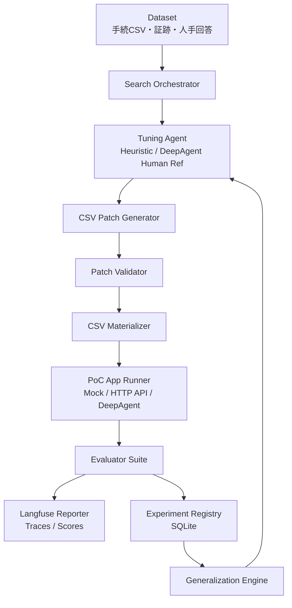

# PoC Automation

自社AIエージェントアプリケーションのPoCチューニングを自動探索するためのプロトタイプです。

このリポジトリは、手続CSVと証跡を入力にして評価結果・根拠・引用を生成する既存アプリケーションに対し、CSVの追加指示を自動生成・検証・実行・評価・蓄積し、最終的に個別最適ではなく共通化可能なチューニングを探索することを目的にしています。

## できること

- 手続CSVに対するチューニング差分を `patch` として管理
- チューニング候補の自動生成
- リーク・過学習・CSV構文の検査
- 自社PoCアプリAPIへの差し替え可能なRunner
- OpenRouter HTTP + Qwen による評価対象エージェントRunner
- 判定、根拠、引用、形式、リークリスクの評価
- SQLiteベースのExperiment Registry
- Langfuse連携用のTrace / Scoreラッパー
- OpenRouter HTTP 経由の human-reference tuning Agent adapter
- 効果のあった指示の原子化・汎用化候補生成
- holdout評価と昇格判断の台帳化
- サンプルデータで一気通貫に動くローカルdemo

## アーキテクチャ



詳細は [`docs/architecture.md`](docs/architecture.md) を参照してください。

## クイックスタート

Python 3.11以上を使います。

```bash
python -m venv .venv
source .venv/bin/activate
pip install -e .[dev]
```

ローカルのMock Runnerで、探索ループ全体を実行します。

```bash
poc-auto demo --workspace .tmp/demo --iterations 2
```

直接実行する場合は以下です。

```bash
poc-auto run-search \
  --dataset examples/dataset.json \
  --db .tmp/poc_automation.sqlite \
  --artifact-dir .tmp/artifacts \
  --agent heuristic \
  --runner mock \
  --iterations 2
```

探索結果のレポートを出力します。

```bash
poc-auto export-report \
  --db .tmp/poc_automation.sqlite \
  --out .tmp/report.md
```

テストを実行します。

```bash
PYTHONPATH=src pytest -q
```


## DeepAgent評価対象Runnerを使う

既存実装には、外部APIなしで探索ループを検証するための `MockPocAppRunner` が含まれています。これは実LLMではなく、CSV追加指示に含まれる語を見て疑似的に結果を返す決定論的runnerです。

実LLMで評価対象アプリを代替したい場合は、`--runner deepagent` を使います。このrunnerは、OpenRouter HTTPで評価対象エージェントを作成し、OpenRouter経由でQwenを呼び出します。

```bash
pip install -e .
export OPENROUTER_API_KEY=sk-or-v1-...
export OPENROUTER_MODEL=qwen/qwen3-max

poc-auto run-search \
  --dataset examples/dataset.json \
  --db .tmp/poc_automation.sqlite \
  --artifact-dir .tmp/artifacts \
  --agent heuristic \
  --runner deepagent \
  --iterations 1
```

`--agent` はチューニング候補を生成する側、`--runner` は評価対象アプリを実行する側です。現行のLLM実行では、探索側に `deepagent-human-ref`、評価対象側に `deepagent` runnerを指定し、どちらもOpenRouter HTTP経由でQwenを呼び出します。

```bash
poc-auto run-search \
  --dataset examples/dataset.json \
  --agent deepagent-human-ref \
  --runner deepagent
```

詳細は [`docs/target_deepagent_runner.md`](docs/target_deepagent_runner.md) を参照してください。

## 自社PoCアプリAPIにつなぐ

`--runner http` を使うと、`HttpPocAppRunner` がAPIを呼び出します。

```bash
export POC_APP_BASE_URL=http://localhost:8080
export POC_APP_API_KEY=replace-me

poc-auto run-search \
  --dataset path/to/dataset.json \
  --db .tmp/poc_automation.sqlite \
  --artifact-dir .tmp/artifacts \
  --agent heuristic \
  --runner http
```

HTTP APIのエンドポイント形状は `src/poc_automation/runner.py` の `HttpEndpointMap` を調整してください。標準では以下を想定しています。

```text
POST /evidence
POST /procedure-csv
POST /runs
GET  /runs/{run_id}
```

詳細は [`docs/api_runner.md`](docs/api_runner.md) を参照してください。

## Langfuse連携

Langfuseを使う場合は、以下の環境変数を設定します。

```bash
export LANGFUSE_ENABLED=true
export LANGFUSE_HOST=http://localhost:3000
export LANGFUSE_PUBLIC_KEY=pk-lf-...
export LANGFUSE_SECRET_KEY=sk-lf-...
```

Langfuse SDKが入っていない、または `LANGFUSE_ENABLED=false` の場合、処理は自動的にno-opになり、ローカルRegistryだけで動作します。

詳細は [`docs/langfuse.md`](docs/langfuse.md) を参照してください。

## OpenRouter HTTP連携

通常のローカル実行では `heuristic` Agentを使います。人間結果参照つきの探索では、OpenRouterのAPIキーを設定し、以下のように指定します。

```bash
poc-auto run-search \
  --dataset examples/dataset.json \
  --agent deepagent-human-ref \
  --runner mock
```

```bash
poc-auto run-search \
  --dataset examples/dataset.json \
  --agent deepagent-human-ref \
  --runner mock
```

Agentには、CSV patch候補生成だけを任せます。API実行、評価、保存、昇格判定は通常コードで制御します。

## 主要ディレクトリ

```text
src/poc_automation/
  agents.py            チューニング候補生成Agent
  csv_patch.py         CSV patch検証・適用
  runner.py            PoCアプリRunner
  evaluators.py        評価器
  search.py            自動探索ループ
  registry.py          SQLite Experiment Registry
  generalization.py    原子化・汎用化候補生成
  langfuse_client.py   Langfuse連携ラッパー

docs/
  architecture.md      全体設計
  langfuse.md          Langfuse連携
  data_model.md        DB・dataset・patch設計
  tuning_strategy.md   探索戦略
  security.md          過学習・リーク対策

examples/
  dataset.json         サンプル評価データ
  procedure_base.csv   サンプル手続CSV
```

## 設計上の原則

1. Agentは仮説生成器として使い、真偽判定者にはしない。
2. CSV全体ではなく、差分patchを保存する。
3. 人手回答はEvaluatorだけが扱い、候補生成Agentには直接見せない。
4. holdoutは昇格判定のみに使い、探索ループには戻さない。
5. Langfuseは観測・評価可視化、自前Registryは探索台帳として使う。
6. 効いた候補だけでなく、効かなかった候補も保存する。
