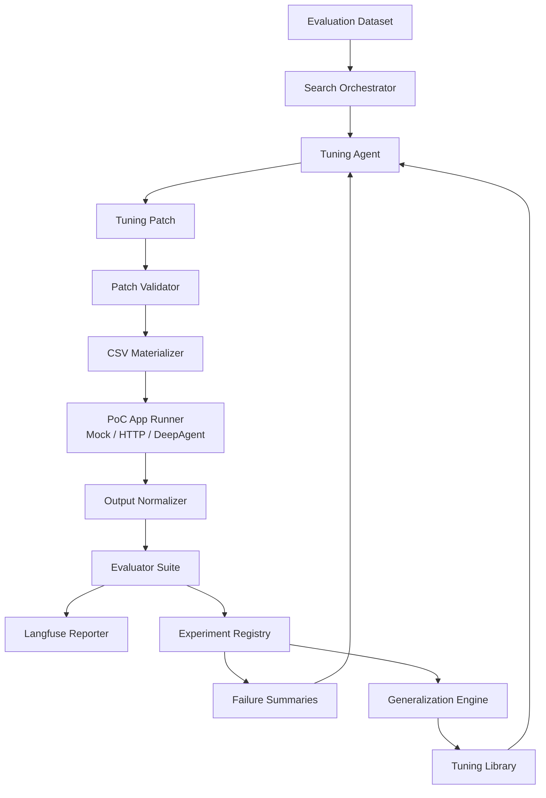
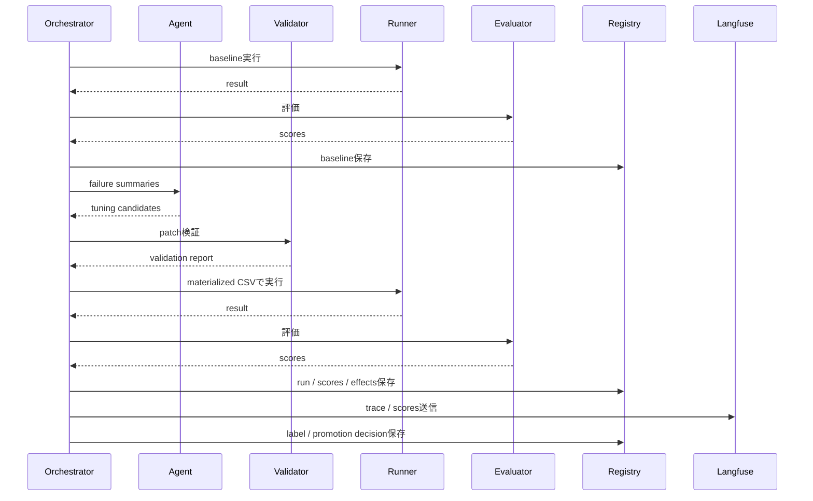

# アーキテクチャ

## 目的

このプロトタイプは、手続CSVとアップロード証跡をもとに評価結果・根拠・引用を生成するAIエージェントアプリケーションに対し、PoC時のCSVチューニング作業を自動探索するためのものです。

PoCでは、人手で準備された回答と同等の結果を得るために、手続CSVの追加指示を調整します。この作業を大量に実施し、効果のあったチューニングをラベル付けし、最終的には個別具体の調整ではなく、より汎用的で共通利用できる調整ルールを発見します。

## 全体構成



## コンポーネント責務

### Search Orchestrator

`src/poc_automation/search.py`

探索全体を制御します。

- ベースライン実行
- 失敗要約の生成
- Agentへの候補生成依頼
- patch検証
- CSV materialize
- PoCアプリ実行
- 評価
- Registry保存
- Langfuse連携
- positive / risky / neutral などのラベル付け
- holdout評価
- promotion decision保存

Agentに全体制御を任せない点が重要です。Agentは候補生成と分析に限定し、実験の真偽判定は固定コードで行います。

### Tuning Agent

`src/poc_automation/agents.py`

CSVに追記する追加指示の候補を作ります。以下の3種類を切り替え可能です。

- `heuristic`: ローカルで確実に動くテンプレートAgent
- `deepagents-code`: Deep Agents Code CLIを呼び出すadapter
- `cline`: Cline CLIを呼び出すadapter

Agentは以下のJSON相当の情報を受け取り、patch候補を返します。

```json
{
  "failures": [
    {
      "case_id": "case_001",
      "failure_mode": "citation_mismatch",
      "summary": "引用箇所が不足している",
      "missing_capability": "根拠文と引用箇所の対応付け"
    }
  ],
  "base_csv_id": "procedure_base",
  "row_selector": {"step_id": "s1"},
  "max_candidates": 8
}
```

### Tuning Patch

`src/poc_automation/models.py`

チューニングはCSV全体ではなく、差分として保存します。

```json
{
  "operation": "append_instruction",
  "target": {
    "procedure_csv_base_id": "procedure_base",
    "row_selector": {"step_id": "s1"},
    "column": "additional_instruction"
  },
  "text": "根拠は証跡に明示された内容のみを使用する。"
}
```

この形式により、候補の親子関係、合成、原子化、昇格判断、レビューが可能になります。

### Patch Validator

`src/poc_automation/csv_patch.py`

patchを適用する前に以下を検査します。

- 対象列がCSVに存在するか
- row_selectorが対象行に一致するか
- 追加指示が空ではないか
- 追加指示が長すぎないか
- `case_001` などケース固有表現を含まないか
- `人手回答`、`正解` などのリーク疑い表現を含まないか
- 指定されたケース固有値・人手回答由来フレーズを含まないか

### CSV Materializer

`src/poc_automation/csv_patch.py`

ベースCSVにpatchを適用し、実行用CSVを生成します。適用結果のunified diffも保存します。

### PoC App Runner

`src/poc_automation/runner.py`

実際のAIエージェントアプリケーションを呼び出すadapterです。

- `MockPocAppRunner`: ローカルdemo・テスト用
- `HttpPocAppRunner`: 実API呼び出し用
- `DeepAgentPocAppRunner`: LangChain Deep Agents + OpenRouter/Qwenで評価対象アプリを代替する実LLM runner

標準のHTTP想定は次の通りです。

```text
POST /evidence
POST /procedure-csv
POST /runs
GET  /runs/{run_id}
```

実際のAPI形状が異なる場合は `HttpEndpointMap` または `HttpPocAppRunner` を拡張します。実PoCアプリAPIが未接続の段階でも、`--runner deepagent` によりDeepAgent/Qwenを評価対象として探索ループを回せます。

### Evaluator Suite

`src/poc_automation/evaluators.py`

以下の評価を行います。

- `judgement_match`: 最終判定が人手回答と一致するか
- `rationale_support`: 根拠が期待論点をカバーするか
- `citation_quality`: 引用が期待引用と一致するか
- `format_valid`: 必須項目があるか
- `unsupported_claim_rate`: 引用のない根拠が多くないか
- `leakage_risk`: 指示にリーク疑いがないか
- `total_score`: 重み付き総合スコア

### Experiment Registry

`src/poc_automation/registry.py`

探索の正本です。Langfuseとは別に、以下をSQLiteへ保存します。

- tuning candidate
- experiment batch
- case run
- evaluation result
- tuning effect
- tuning atom
- promotion decision

プロトタイプはSQLiteですが、本番ではPostgreSQLへ移行しやすいスキーマにしています。

### Langfuse Reporter

`src/poc_automation/langfuse_client.py`

LangfuseへTraceとScoreを送ります。SDKがない、または `LANGFUSE_ENABLED=false` の場合はno-opとして動作します。

Langfuseは観測・比較UIとして使い、自前Registryを探索台帳として使います。

### Generalization Engine

`src/poc_automation/generalization.py`

positive候補を文単位に原子化し、以下のようなtactic別に分類します。

- evidence_grounding
- citation_rule
- condition_branching
- abstention_rule
- contradiction_handling
- schema_enforcement

同じtacticで複数候補が効果を出した場合、共通指示候補を生成します。

## 探索ループ



## 最初から最終形として持つ機能

このプロトタイプは段階的Milestoneではなく、一気通貫で以下を持ちます。

- baseline実行
- 候補生成
- patch検証
- cheap evaluation
- validation evaluation
- holdout evaluation
- 自動ラベル付け
- 原子化
- 汎用化候補生成
- promotion decision
- Langfuse連携
- Registry保存
- Markdown report出力

ただし、各処理は小さいデータセットと少ない探索予算で動かせるようにしています。
